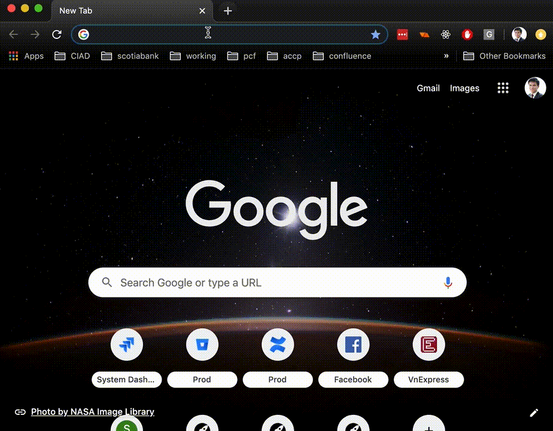

# Google Translate Proxy for Github

## What is this extension
### Feature
This extension will help users read content from blocked websites via Google Translate.

### Limitations
- Google Translate will not help you access any raw files in Github

### Ongoing features
- Allow users to enable/disable the extension easily.
- Allow users to add more websites they want to proxy.
- Allow users to custumize the proxy URL.s

## How to install the plugin
- Check out the source code of this extension.
- In the Chrome brower, Go to [chrome://extensions/](chrome://extensions/).
- In the top right corner, enable "Developer mode".
- Choose the "Load unpacked" option and select this plugin source folder to load this extension in the unpacked format.

